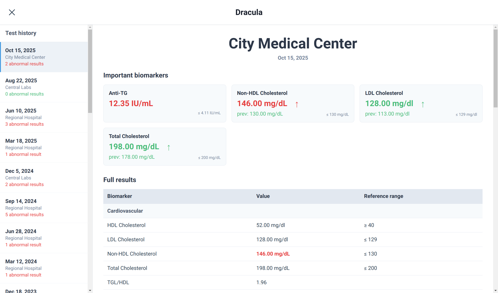
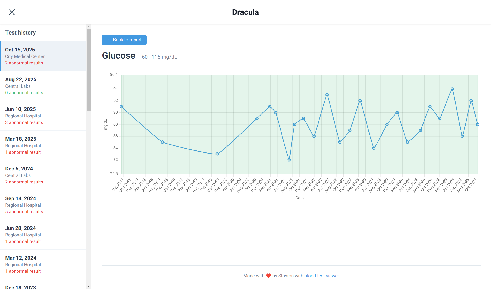
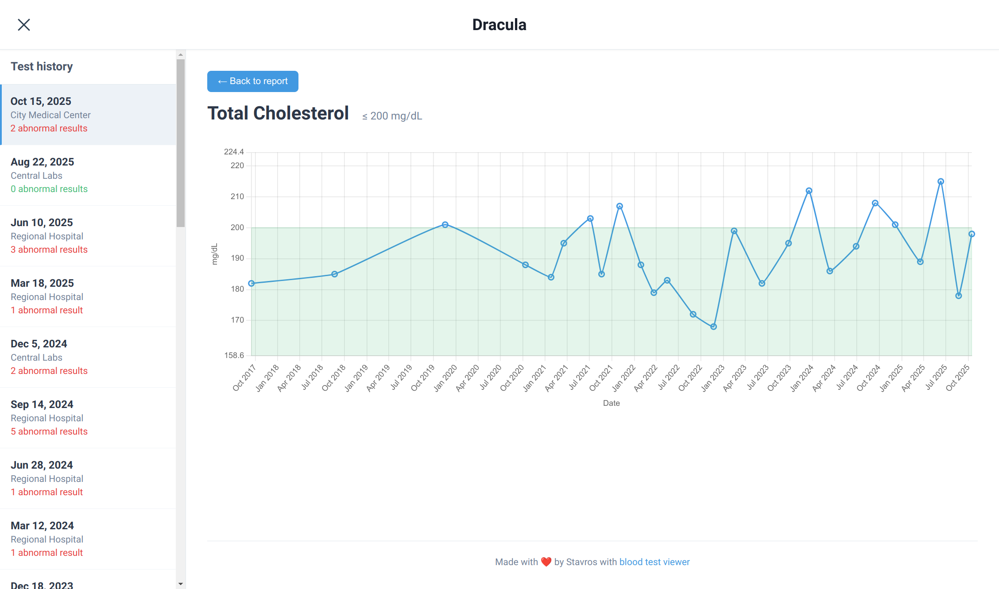

# Dracula

A complete blood test management system that extracts data from PDF scans, generates AI-powered assessments, and provides interactive visualizations. All data is stored locally with no backend required.

## Features

- **PDF OCR extraction**: Automatically extract blood test data from PDF scans using Claude AI
- **AI-powered assessments**: Generate medical insights and trend analysis for each test
- **Single report view**: View individual blood test results with highlighted abnormalities
- **Longitudinal tracking**: Visualize biomarker trends over time with interactive charts
- **Important biomarkers**: Automatically highlights biomarkers that are currently out of range or have been abnormal in recent tests
- **Dark mode**: Toggle between light and dark themes
- **Static deployment**: No server required - works as a simple HTML file with embedded data

## Screenshots

### Main page


### Biomarker history



## Prerequisites

- [uv](https://docs.astral.sh/uv/) - Python package manager and script runner
- A modern web browser (Chrome, Firefox, Safari, or Edge)
- [Anthropic API key](https://console.anthropic.com/) (for OCR and assessment features)
- `poppler-utils` package (for PDF to image conversion):
  - Ubuntu/Debian: `sudo apt-get install poppler-utils`
  - macOS: `brew install poppler`
  - Windows: Download from [poppler releases](https://github.com/oschwartz10612/poppler-windows/releases/)

### Setting up your API key

Export your Anthropic API key as an environment variable:
```bash
export ANTHROPIC_API_KEY='your-api-key-here'
```

Or add it to your `~/.bashrc` or `~/.zshrc` for persistence.

## Complete workflow

### 1. Create your tracking spreadsheet

Create an OpenDocument Spreadsheet (.ods) with this structure:

**Required columns:**
- Column A: `Date` - Test date in YYYY-MM-DD format
- Column B: `Lab` - Laboratory name
- Columns C onwards: Biomarker columns (format: `Name {unit} [low-high]`)
- Last column: `Assessment` - AI-generated assessment (leave empty initially)

**Example:**
```
| Date       | Lab      | Glucose {mg/dL} [70-100] | HbA1c {%} [4-5.6] | Assessment |
|------------|----------|--------------------------|-------------------|------------|
| 2024-06-12 | Acme Lab |                          |                   |            |
```

### 2. Extract data from PDF scans (OCR)

Use `bt_ocr.py` to automatically extract biomarker data from blood test PDFs:

```bash
./bt_ocr.py path/to/blood-test.pdf --ods path/to/tracking.ods
```

This will:
- Convert the PDF to PNG images
- Use Claude Vision to extract biomarker names, values, units, and reference ranges
- Match biomarkers to existing columns in your spreadsheet
- Add new columns for any biomarkers not already tracked
- Insert a new row with the extracted data

**Options:**
- `--model` - Specify Anthropic model (default: claude-opus-4-1)
- `--no-ocr` - Only convert PDF to images without OCR
- `--output` - Save OCR results to JSON file
- `--prefix` - Filename prefix for generated images (default: page)

### 3. Generate AI assessments

Use `assessment.py` to generate medical insights for tests without assessments:

```bash
./assessment.py path/to/tracking.ods
```

This will:
- Identify important biomarkers (out of range in current or previous 3 tests)
- Generate contextual assessments using Claude AI
- Write assessments back to the spreadsheet

**Options:**
- `--model` - Specify Anthropic model (default: claude-opus-4-1)
- `--limit N` - Only process N tests (for testing)
- `--dry-run` - Generate dummy assessments without calling API

### 4. Convert to JSON for web viewer

Convert your ODS file to JSON format:

```bash
./converter.py path/to/tracking.ods
```

This generates `data.json` containing all test data and categories.

### 5. View in browser

Open `index.html` in your web browser to view the interactive dashboard.

## Getting started (quick start)

If you already have data in CSV/ODS format:

1. Run the converter:
   ```bash
   ./converter.py input.ods
   ```
2. Open `index.html` in your browser

## Spreadsheet format reference

### Required columns

1. **Date** (Column A): Test date in ISO-8601 format (YYYY-MM-DD recommended)
   - Examples: `2024-06-12`, `2024/06/12`, `12/06/2024`
   - The converter will parse various date formats automatically

2. **Lab** (Column B): Laboratory/clinic name
   - The OCR tool will try to match lab names to existing entries

3. **Biomarker columns**: Each biomarker is a separate column
   - Header format: `Name {unit} [low-high]`
   - Examples:
     - `Hemoglobin {g/dL} [13.5-17.5]` - Both bounds
     - `Vitamin D {ng/mL} [30-]` - Minimum only (≥30)
     - `LDL Cholesterol {mg/dL} [-129]` - Maximum only (≤129)
     - `CRP {mg/L} []` - No reference range
     - `Platelet Count {×10³/µL}` - Unit only, no range

4. **Assessment** (Last column): AI-generated medical assessment
   - Leave empty initially
   - Will be populated by `assessment.py`

### Categories (optional)

Add a "Categories" section at the bottom of your spreadsheet to group biomarkers:

```
[Empty row]
Categories

Category Name   | Biomarker 1 | Biomarker 2 | Biomarker 3
----------------|-------------|-------------|------------
Lipid panel     | Total Cholesterol | LDL Cholesterol | HDL Cholesterol | Triglycerides
Complete blood count | Hemoglobin | Hematocrit | White Blood Cell Count | Platelet Count
```

The first column is the category name, followed by biomarker names that belong to that category.

### Value formats

- **Numeric values**: Plain numbers that will appear in charts
  - Examples: `14.1`, `120`, `45.5`
- **Non-numeric values**: Strings for qualitative results
  - Examples: `<5`, `>200`, `NEG`, `POS`, `Negative`
  - These won't appear in longitudinal charts but will show in the table

### Sample ODS structure

```
| Date       | Lab      | Glucose {mg/dL} [70-100] | HbA1c {%} [4-5.6] | LDL {mg/dL} [-129] | Assessment |
|------------|----------|--------------------------|-------------------|--------------------|------------|
| 2024-06-12 | Acme Lab | 95                       | 5.4               | 120                |            |
| 2024-03-10 | Acme Lab | 102                      | 5.7               | 135                |            |
| 2023-12-01 | Lab B    | 88                       | 5.2               | 125                |            |

[Empty row]

Categories

Metabolic    | Glucose | HbA1c
Lipid panel  | LDL Cholesterol | HDL Cholesterol
```

## Command reference

### bt_ocr.py - Extract data from PDF scans

```bash
./bt_ocr.py <pdf_file> --ods <ods_file> [options]
```

**Required arguments:**
- `pdf_file` - Path to the blood test PDF
- `--ods` - Path to the OpenDocument spreadsheet

**Optional arguments:**
- `--model MODEL` - Anthropic model to use (default: claude-opus-4-1)
- `--prefix PREFIX` - Filename prefix for images (default: page)
- `--no-ocr` - Only convert PDF to images, skip OCR
- `--output FILE` - Save OCR results to JSON file

**Examples:**
```bash
# Basic usage
./bt_ocr.py blood-test.pdf --ods tracking.ods

# Use a different model
./bt_ocr.py blood-test.pdf --ods tracking.ods --model claude-sonnet-4

# Save OCR results to JSON
./bt_ocr.py blood-test.pdf --ods tracking.ods --output results.json

# Only convert PDF to images (for manual review)
./bt_ocr.py blood-test.pdf --ods tracking.ods --no-ocr
```

### assessment.py - Generate AI assessments

```bash
./assessment.py <ods_file> [options]
```

**Required arguments:**
- `ods_file` - Path to the OpenDocument spreadsheet

**Optional arguments:**
- `--model MODEL` - Anthropic model to use (default: claude-opus-4-1)
- `--limit N` - Only process N tests (for testing)
- `--dry-run` - Generate dummy assessments without API calls

**Examples:**
```bash
# Generate assessments for all tests without them
./assessment.py tracking.ods

# Only process the first 2 tests (for testing)
./assessment.py tracking.ods --limit 2

# Dry run without API calls
./assessment.py tracking.ods --dry-run
```

### converter.py - Convert ODS/CSV to JSON

```bash
./converter.py <input_file> [output_file]
```

**Arguments:**
- `input_file` - Path to CSV or ODS file
- `output_file` - Output JSON file (default: data.json)

**Examples:**
```bash
# Convert to data.json
./converter.py tracking.ods

# Specify output file
./converter.py tracking.ods blood-tests.json

# Convert from CSV
./converter.py data.csv
```

## Troubleshooting

### OCR issues

**Problem: "ANTHROPIC_API_KEY environment variable is not set"**
```bash
export ANTHROPIC_API_KEY='your-api-key-here'
```

**Problem: "pdftoppm command not found"**
- Install poppler-utils:
  - Ubuntu/Debian: `sudo apt-get install poppler-utils`
  - macOS: `brew install poppler`

**Problem: OCR extracts wrong values**
- Review the PDF images in the temporary directory (shown in output)
- Ensure the PDF is clear and readable
- Try a different model with `--model claude-opus-4-1`

### Assessment issues

**Problem: "No 'Assessment' column found in ODS file"**
- Add an "Assessment" column as the last column in your spreadsheet

**Problem: Assessments are too generic**
- Ensure you have historical data (at least 2-3 tests)
- The assessment quality improves with more historical context

### Converter issues

**Problem: "No 'Date' column found in data"**
- Ensure your spreadsheet has a column with "date" in the name (case-insensitive)

**Problem: "No valid biomarker columns found"**
- Check that biomarker headers follow the format: `Name {unit} [low-high]`
- At minimum, columns need a name (unit and range are optional)

**Problem: Biomarkers appear in wrong categories**
- Check the Categories section at the bottom of your spreadsheet
- Ensure biomarker names match exactly (case-sensitive)

### Web viewer issues

**Problem: "Failed to load data"**
- Ensure `data.json` exists in the same directory as `index.html`
- Check browser console (F12) for detailed error messages
- Verify JSON is valid with `python -m json.tool data.json`

**Problem: Charts not showing**
- Charts only show for numeric values
- Check that your biomarker values are numbers, not strings like "<5"

**Problem: Dark mode not persisting**
- The preference is saved in browser localStorage
- Check that your browser allows localStorage for local files

## License

MIT License - See LICENSE file for details
